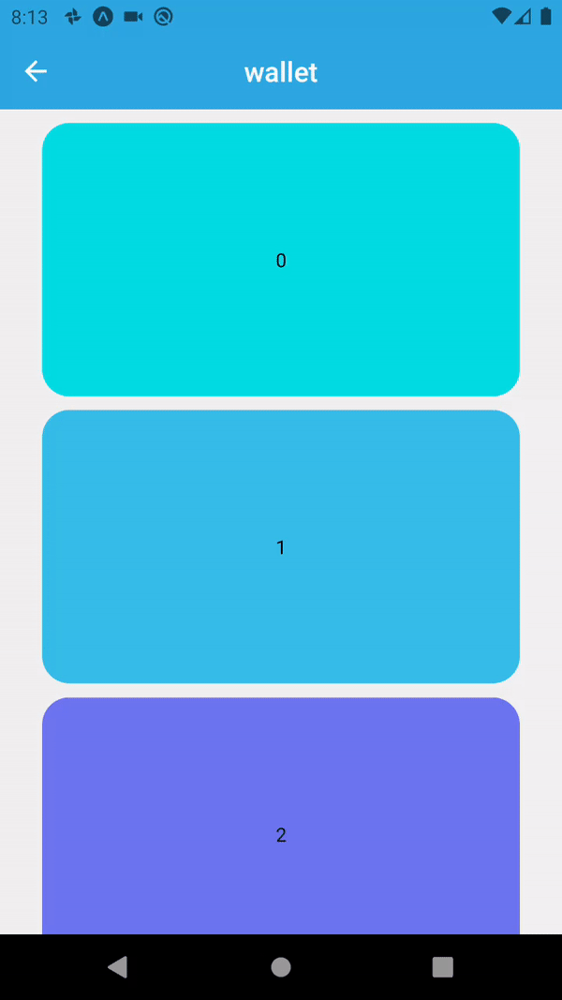

# Animation Paradise

This is a repository where I'll try to create and save tamplates of useful animations made in react native to be used in future projects. All gathered together in a sigle app.

## Image blur on load

[Code](https://github.com/GabrielDVpereira/Animation-Paradise/tree/master/templates/animations/image-blur)

## Animation modal

[Code](https://github.com/GabrielDVpereira/Animation-Paradise/tree/master/templates/animations/Modal1)

## Deck swipe

[code](https://github.com/GabrielDVpereira/Animation-Paradise/tree/master/templates/animations/deck-swiper)

## swipeable list

[code](https://github.com/GabrielDVpereira/Animation-Paradise/tree/master/templates/animations/Swipe-list)

## hidable input

[code](https://github.com/GabrielDVpereira/Animation-Paradise/tree/master/templates/animations/hide-input)

## swipe images

[code](https://github.com/GabrielDVpereira/Animation-Paradise/tree/master/templates/animations/swipe-image)

## Shimmer effect

[code](https://github.com/GabrielDVpereira/Animation-Paradise/tree/master/templates/animations/shimmer-effect)

## Hidable header

[code](https://github.com/GabrielDVpereira/Animation-Paradise/tree/master/templates/animations/airbnb-header)

## Simple drag and drop

[code](https://github.com/GabrielDVpereira/Animation-Paradise/tree/master/templates/animations/DragAndDrop)

## Wallet

[code](https://github.com/GabrielDVpereira/Animation-Paradise/tree/master/templates/animations/wallet)

## Image-swipe 2

[code](https://github.com/GabrielDVpereira/Animation-Paradise/tree/master/templates/animations/swipe-image-02)

## button

[code](https://github.com/GabrielDVpereira/Animation-Paradise/tree/master/templates/animations/buttonAnimation01)

## Toggle

[code](https://github.com/GabrielDVpereira/Animation-Paradise/tree/master/templates/animations/Toggle)

